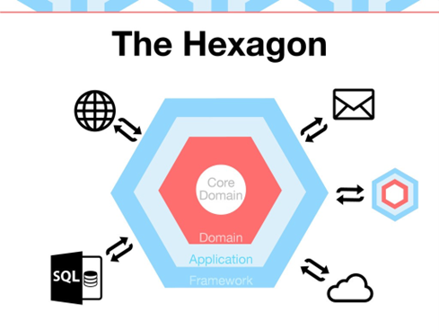

<h1 style="text-align: center;">
    Contacts Management System
</h1>

<div style="text-align: center;">

[](https://en.wikipedia.org/wiki/Hexagonal_architecture_(software))
[](https://echo.labstack.com/)
[](https://www.postgresql.org/)
[](https://www.docker.com/)

[](./LICENSE)

</div>

This project is a Golang-based application for contacts, utilizing the echo framework and following the Hexagonal Architecture pattern for a clean separation of concerns and modular design.

## Project Structure

The application is organized around three main entities: `Contact`. Each entity is encapsulated within three packages representing the layers of the Hexagonal Architecture:

- `infrastructure`: Contains code related to database operations, networking, and interfacing with external systems.
- `application`: Hosts the application logic, defining use cases and orchestrating between the infrastructure and domain layers.
- `domain`: Defines the business models and core business logic.

The following diagram illustrates the Hexagonal Architecture pattern:

- 

## Technologies Used

- **Programming Language:** GO 1.22
- **Framework:** Echo
- **Build Tool:** Build
- **Database:** PostgreSQL


## Error Handling

The application includes robust error handling for managing exceptions gracefully, ensuring reliability and ease of debugging.

## Database Migrations

The initial database schema is provided in the `migrations` folder. These migration files are utilized within the Docker Compose setup to initialize the PostgreSQL database.

## Snowflake IDs

We use the Snowflake algorithm to generate unique identifiers (IDs) for distributed computing, providing a unique sequence that is time sortable.

## Health Check Endpoint

A `/ping` endpoint is available and can be used in deployment systems to check the health of the application.


## How to Use

To query contacts, use the following endpoint structure:

start container

```docker-compose
docker-compose up --build
```

execute
```curl
curl --location 'http://localhost:8085/v1/contacts' \
```